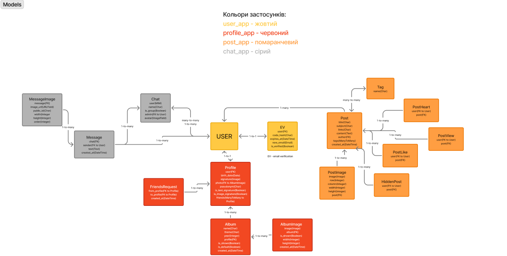
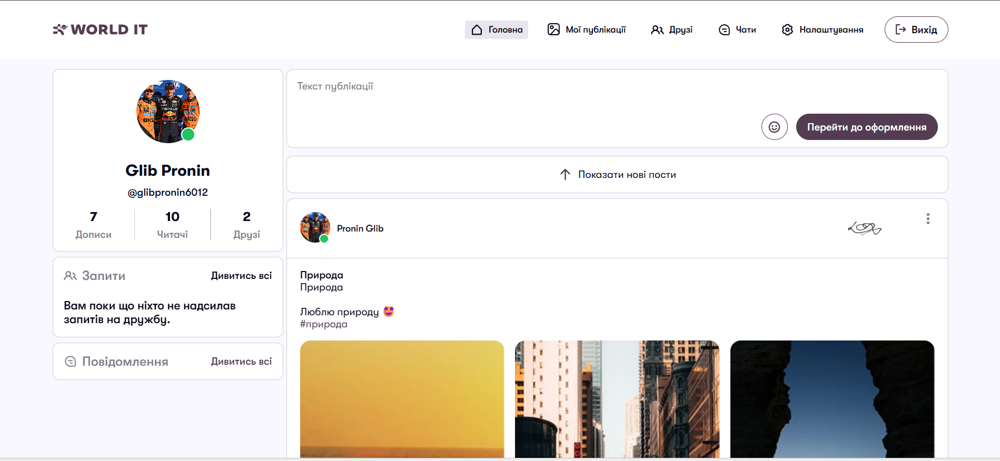
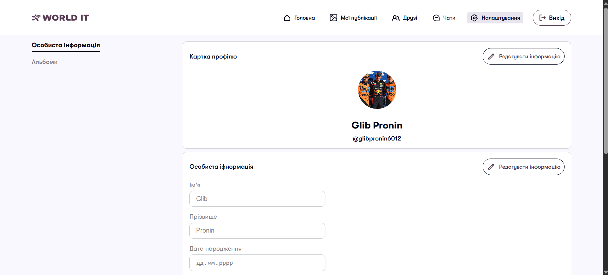
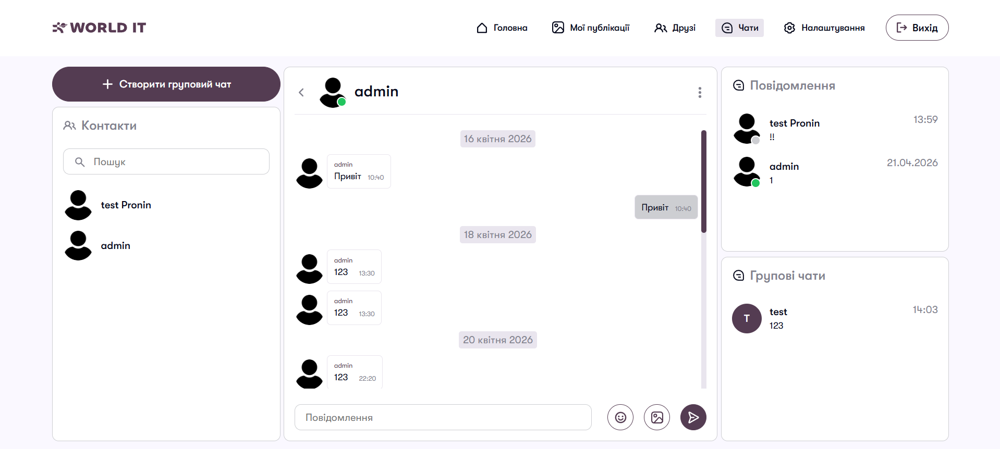
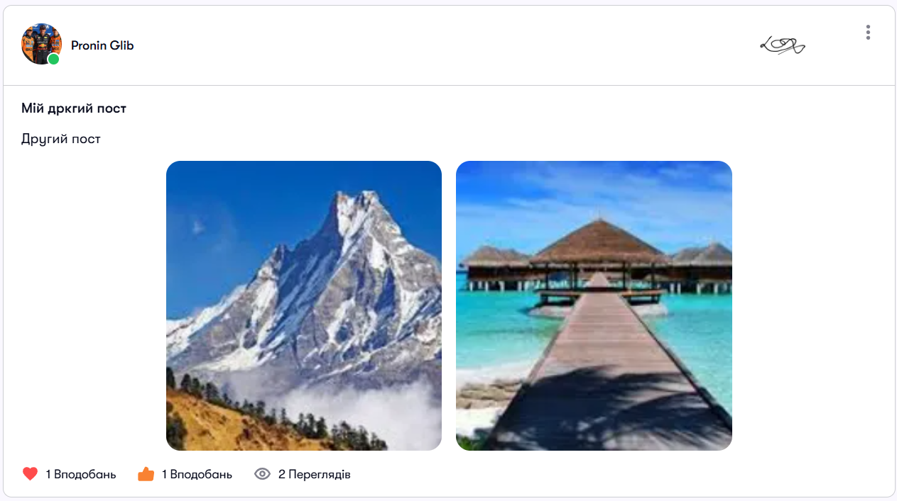
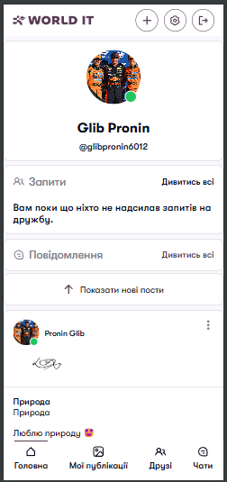
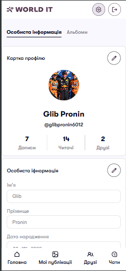
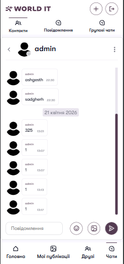
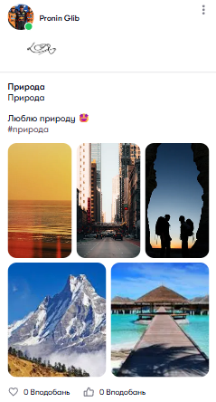

# World IT 🌍

**World IT** - це сучасна соціальна мережа, створена з використанням Django та сучасних вебтехнологій. Платформа надає можливість користувачам спілкуватися, створювати контент, взаємодіяти між собою та користуватися real-time функціоналом без перезавантаження сторінки.  
**Розроблено як навчальний проєкт на курсах World IT.**

---
## Зміст
1. [Основні можливості](#1-основні-можливості)
2. [Технології](#2-технології)
3. [Реалізація роботи в реальному часі](#3-реалізація-роботи-в-реальному-часі)
4. [База даних](#4-база-даних)
5. [Дизайн та інтерфейс](#5-дизайн-та-інтерфейс)
6. [Адаптивність](#6-адаптивність)
7. [Архітектура проєкту](#7-архітектура-проєкту)
8. [Безпека](#8-безпека)
9. [Налаштування .env файлу](#9-налаштування-env-файлу)
10. [Запуск локально](#10-запуск-локально)
11. [Майбутні покращення](#11-майбутні-покращення)
12. [Розробник](#12-розробник)

---
## 1. Основні можливості

### 👤 Користувачі та профілі

- Реєстрація з підтвердженням електронної пошти
- Авторизація через email/password
- Вхід через Google акаунт
- Зміна пошти з повторним підтвердженням
- Редагування профілю
- Завантаження аватару
- Збереження електронного підпису як зображення

---

### 📝 Контент

- Створення постів
- Лайки до постів
- Стрічка постів
- Infinite Scroll (автоматичне підвантаження постів)
- Перегляд профілів інших користувачів

---

### 🖼️ Альбоми

- Створення альбомів
- Додавання фотографій
- Перегляд особистих фотоальбомів

---

### 🤝 Друзі

- Надсилання заявки в друзі
- Прийняття заявки
- Відхилення заявки
- Видалення друзів
- Перегляд списку друзів та рекомендацій

---

### 💬 Чати

- Приватні чати
- Групові чати
- Повідомлення в реальному часі
- Онлайн / офлайн статус
- Індикатори непрочитаних повідомлень

---

### 🔔 Сповіщення

- Внутрішні сповіщення на сайті
- Динамічне оновлення індикаторів (онлайн / офлайн статус)

---
## 2. Технології

### Backend

- Python
- Django 5.2
- Django Channels
- PostgreSQL
- Redis

### Frontend

- HTML5
- CSS3
- JavaScript
- Fetch API

### Frontend бібліотеки

**SortableJS**

Використовується для drag & drop взаємодії та сортування фото у формі створення посту.

🔗 https://sortablejs.github.io/Sortable/

---
**Signature Pad**

Використовується для створення та збереження електронного підпису користувача через Canvas.

🔗 https://github.com/szimek/signature_pad

---
**PhotoSwipe**

Використовується для перегляду фото у галереях та альбомах у форматі lightbox.

🔗 https://photoswipe.com/

---

### Інтеграції

**SendGrid**

Використовується для надсилання електронних листів:

- підтвердження реєстрації
- зміна email адреси

🔗 https://sendgrid.com/

---
**Google OAuth**

Реалізовано авторизацію через Google акаунт за допомогою Django Allauth.

Після реєстрації у системі користувач може використовувати Google OAuth як альтернативний спосіб входу до акаунта.

🔗 https://developers.google.com/identity

---
**Cloudinary**

Використовується для зберігання медіафайлів:

- аватари користувачів
- фото постів
- зображення альбомів
- інші завантажені файли

🔗 https://cloudinary.com/

---
**WhiteNoise**

Використовується для обслуговування статичних файлів у production:

- CSS
- JavaScript
- локальні static assets

🔗 https://whitenoise.readthedocs.io/

---
## 3. Реалізація роботи в реальному часі

Для чатів та онлайн-статусів використано:

- WebSocket
- Django Channels
- Redis Channel Layer

Це дозволяє миттєво отримувати повідомлення без оновлення сторінки.

---
## 4. База даних

У проєкті використано PostgreSQL.

Основні сутності:

- User
- Profile
- Post
- Like
- FriendRequest
- Chat
- Message
- Album
- AlbumPhoto

### Схема БД



[Посилання на структуру (Figma Jam)](https://www.figma.com/board/hI5JClp4fR1A5jNEn8I9AQ/SocialNetwork-DB?node-id=0-1&t=mzlUM8xwGI4id5ZO-1)

---
## 5. Дизайн та інтерфейс

Дизайн інтерфейсу був зроблений у Figma:
[Посиаллня на Figma](https://www.figma.com/design/2QiH7cXImqkGOHIl9xPClV/Projects?node-id=1388-5366&t=7u4slpp8a4vvZCCm-1)


> Головна сторінка


> Налаштування профілю


> Сторінка чатів


> Вигляд посту

---
## 6. Адаптивність

Інтерфейс повністю адаптований для:

- смартфонів
- планшетів
- ноутбуків
- десктопів

Коректно відображаються:

- меню навігації
- стрічка постів
- профілі
- чати
- форми входу та реєстрації

**Мобільна версія:**


> Головна сторінка


> Налаштування профілю


> Сторінка чатів


> Вигляд посту

---
## 7. Архітектура проєкту

Проєкт поділений на Django apps:

- user_app
- profile_app
- post_app
- chat_app

Це забезпечує:

- модульність
- зручну підтримку
- масштабованість

---
## 8. Безпека

- CSRF захист
- Підтвердження email
- Захищена авторизація
- OAuth через Google
- Робота через HTTPS у production

---
## 9. Налаштування .env файлу

```
# Django
DEBUG=
CSRF_TRUSTED_ORIGINS=

# DATABASE
DATABASE_URL=

# REDIS
REDIS_URL=

# Cloudinary
CLOUDINARY_API_SECRET=
CLOUDINARY_API_KEY=
CLOUD_NAME=

# SendGrid
DEFAULT_FROM_EMAIL=
SENDGRID_API_KEY=
```

---
## 10. Запуск локально

1. Клонування репозиторію:
```
git clone https://github.com/glib-pronin/Social-Network.git
cd SocialNetwork
```

2. Встановлення залежностей:  
```
python -m venv venv
venv\Scripts\activate
pip install -r requirements.txt
```

3. Налаштування:   
    - Створити .env

4. Запуск:  
```
python manage.py migrate
python manage.py runserver
```

---
## 11. Майбутні покращення

- Коментарі до постів
- Push-сповіщення
- Темна тема
- Мобільний застосунок

---
## 12. Розробник

- Ім’я: Гліб Пронін
- Роль: Розробник соціальної мережі "World IT"
- GitHub: [glib-pronin](https://github.com/)